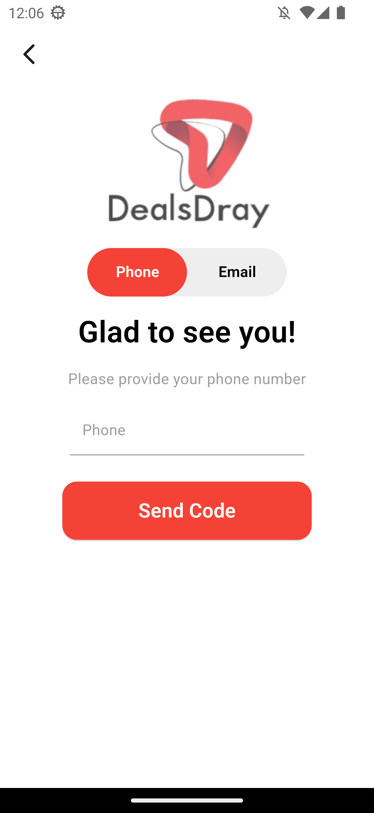
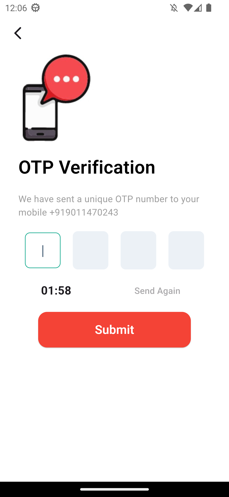
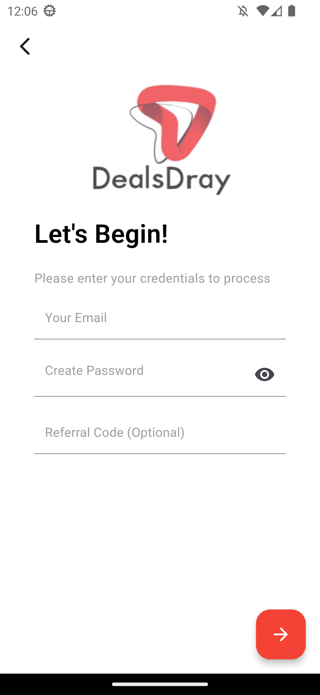
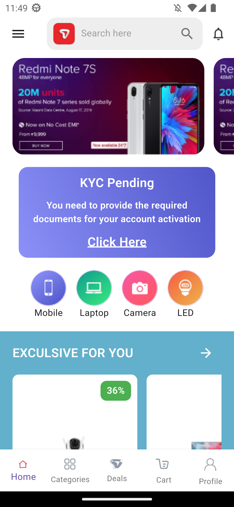
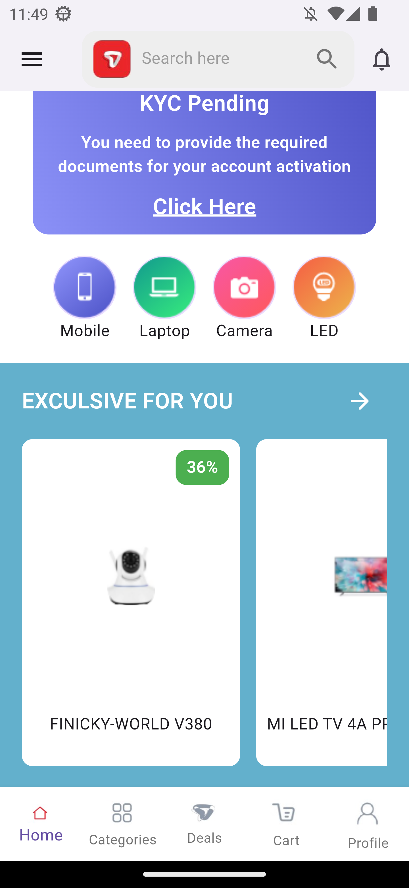

# Phone Number Login with OTP

This is a Flutter project that allows users to log in using their phone number. The process includes sending an OTP (One-Time Password) to the user's phone, verifying it, and then checking if the user is a first-time user or already registered. If the user is new, they are navigated to an email and password registration screen. If they are already registered, they are redirected to the home screen.

## Features

- **Phone Number Authentication**: Users can log in using their phone number.
- **OTP Verification**: OTP is sent to the phone number for verification.
- **Email and Password Registration**: New users are navigated to a registration screen to enter their email and password.
- **Home Screen Navigation**: Returning users are directed to the home screen.

## Installation

1. **Clone the repository**:

   ```bash
   git clone https://github.com/your-username/your-repository-name.git
   cd your-repository-name
   ```

2. **Install dependencies**:

   ```bash
   flutter pub get
   ```

3. **Run the app**:

   Make sure you have a device (simulator or real device) connected and then run:

   ```bash
   flutter run
   ```

## Dependencies

This project uses the following dependencies:

- `dio`: For making HTTP requests.
- `flutter_bloc`: For state management using the BLoC pattern.
- `flutter_screenutil`: For responsive design.
- `pinput`: For PIN input field (OTP input).
- `freezed`, `freezed_annotation`: For immutable data classes and code generation.
- `json_serializable`, `json_annotation`: For automatic JSON serialization.

For the full list of dependencies, see the `pubspec.yaml` file.

## App Flow

### 1. **Login Screen**

   The user is prompted to enter their phone number. Upon submitting the phone number, an OTP is sent to the user's mobile number.

### 2. **OTP Verification**

   - The user enters the OTP sent to their phone number in a pin input field.
   - The OTP is verified by the server.

### 3. **Registration or Home Screen**

   - If the user is a first-time user, they are redirected to an **email/password registration screen**.
   - If the user is already registered, they are redirected to the **Home Screen**.

### 4. **Email and Password Registration (For First-Time Users)**

   If the user is not registered, they will be asked to provide an email and password for registration.

### 5. **Home Screen**

   Upon successful registration or login, the user is taken to the home screen, where they can access the main features of the app.

## Folder Structure

```
lib/
├── auth/
│   ├── email_auth.dart           # Email and password authentication screen
│   ├── manager/
│   │   └── auth_cubit.dart       # BLoC for authentication logic
│   ├── otp_verification.dart     # OTP input screen
│   └── phone_auth.dart           # Phone number login screen
├── home/
│   └── home.dart                 # Home screen (post-login)
├── models/
│   └── otp_model.dart            # OTP model class
├── services/
│   └── api_service.dart          # API service for sending OTP and verifying login
├── utils/
│   └── app_images.dart           # Asset images (icons, logos, etc.)
│   └── app_styles.dart           # App styles (text styles, etc.)
├── widgets/
│   └── custom_button.dart        # Custom button widget
│   └── custom_pin.dart           # Custom PIN input widget
│   └── default_app_bar.dart      # Default app bar widget
└── main.dart                     # Entry point of the app
```

## Code Generation

This project uses code generation for immutable data classes and JSON serialization. To generate the code, run:

```bash
flutter pub run build_runner build
```

To watch for changes and automatically regenerate code, you can use:

```bash
flutter pub run build_runner watch
```

## Screenshots

### Phone Authentication Screen



### OTP Verification Screen



### Registration Screen



### Home Screen





## Contributing

Feel free to fork the repository, open issues, and submit pull requests. Contributions are welcome!

## License

This project is licensed under the MIT License - see the [LICENSE](LICENSE) file for details.
